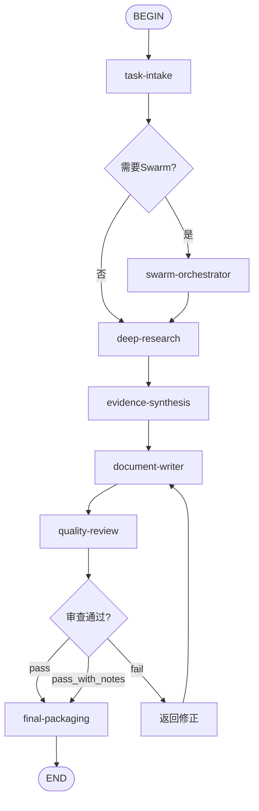

# Deep Research Report Flow

## 目的
编排多个Skill的调用顺序，实现从输入到交付的完整工作流。

## 触发条件
- 任务类型匹配本Flow定义的场景时自动触发
- 用户显式指定使用本Flow时
- task-intake输出匹配Flow的入口条件时

## 调用方式

### 自动触发
当task-intake的结构化任务单满足以下条件时，系统自动路由到本Flow：
- task-intake：将用户需求转化为结构化任务单
- swarm-orchestrator（如需要）：分解复杂任务并分配子Agent
- deep-research：执行多轮搜索，收集高质量证据
- evidence-synthesis：将证据转化为Claim-Evidence Map
- document-writer：撰写结构化报告
- quality-review：9维度质量审查
- final-packaging：整合交付物

### 显式调用
用户可通过指令指定："使用 deep-research-report-flow 处理此任务"

## 流程图

## 步骤说明

### Step 1: task-intake
将用户需求转化为结构化任务单
### Step 2: swarm-orchestrator（如需要）
分解复杂任务并分配子Agent
### Step 3: deep-research
执行多轮搜索，收集高质量证据
### Step 4: evidence-synthesis
将证据转化为Claim-Evidence Map
### Step 5: document-writer
撰写结构化报告
### Step 6: quality-review
9维度质量审查
### Step 7: final-packaging
整合交付物

## 输出契约
- Flow执行完成后输出最终交付物
- 每个中间步骤的输出作为下一步输入
- 质量审查节点为强制gate，fail时触发修正循环

## 失败处理
- 任意Skill节点返回fail时，Flow进入修正分支
- 修正后从最近的safe checkpoint重新执行
- 连续3次fail时升级到用户决策
