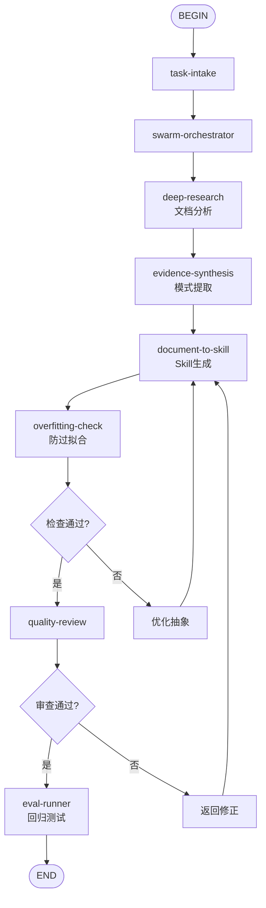

# Document To Skill Flow

## 目的
编排多个Skill的调用顺序，实现从输入到交付的完整工作流。

## 触发条件
- 任务类型匹配本Flow定义的场景时自动触发
- 用户显式指定使用本Flow时
- task-intake输出匹配Flow的入口条件时

## 调用方式

### 自动触发
当task-intake的结构化任务单满足以下条件时，系统自动路由到本Flow：
- task-intake：定义目标Skill的范围和定位
- swarm-orchestrator：分配分析、提取、生成子任务
- deep-research：分析参考文档的方法论
- evidence-synthesis：提取可复用模式和框架
- document-to-skill：转化为结构化Skill定义
- overfitting-check：验证通用性，防止过度绑定
- quality-review：审查Skill质量
- eval-runner：回归测试确保可用性

### 显式调用
用户可通过指令指定："使用 document-to-skill-flow 处理此任务"

## 流程图

## 步骤说明

### Step 1: task-intake
定义目标Skill的范围和定位
### Step 2: swarm-orchestrator
分配分析、提取、生成子任务
### Step 3: deep-research
分析参考文档的方法论
### Step 4: evidence-synthesis
提取可复用模式和框架
### Step 5: document-to-skill
转化为结构化Skill定义
### Step 6: overfitting-check
验证通用性，防止过度绑定
### Step 7: quality-review
审查Skill质量
### Step 8: eval-runner
回归测试确保可用性

## 输出契约
- Flow执行完成后输出最终交付物
- 每个中间步骤的输出作为下一步输入
- 质量审查节点为强制gate，fail时触发修正循环

## 失败处理
- 任意Skill节点返回fail时，Flow进入修正分支
- 修正后从最近的safe checkpoint重新执行
- 连续3次fail时升级到用户决策
