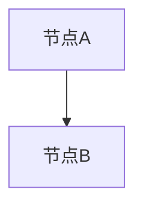

# 报告模板规范 v1.2

## 核心约束

> **document-writer必须遵守的铁律**:
> 1. 不允许新增未经evidence-synthesis支撑的事实
> 2. 所有内容必须基于evidence-synthesis的claim-evidence-map中的可信结论
> 3. 每个事实必须可追溯回claim-evidence-map

---

## 标准报告模板（9部分结构）

```markdown
# [标题]

> **核心约束声明**: 本报告所有事实均基于claim-evidence-map的已验证结论，
> 无新增未经evidence-synthesis支撑的事实。
> Evidence-map引用: [链接到claim-evidence-map.json路径]

---

## [Part 1] 标题

格式: `[主题] — [研究/分析]报告`

要求:
- 简洁明确，不超过30字
- 包含研究对象和报告类型
- 示例: "Kimi Code CLI 个人开发者适用性评估报告"

---

## [Part 2] 一句话结论

格式: 用1-2句话概括核心结论和置信度。

要求:
- 必须标注整体confidence level
- 包含最关键的判断
- 示例:
  "基于对X个来源的分析（confidence: Medium），Kimi Code CLI
  在个人开发者场景下具有可用性，但存在学习曲线陡峭和文档不足的约束。
  [Evidence-map: claim.001-claim.008]"

---

## [Part 3] 背景

内容:
- 研究问题的起源和上下文
- 为什么这个研究是重要的
- 研究范围和边界
- 方法概述（简要说明使用了哪些研究方法）

约束:
- 背景中的每个事实必须有evidence-map支撑
- 不得引入evidence-map中没有的背景信息
- 如果背景信息不充分，标注`[background_insufficient: requires_human_review]`

格式示例:
```markdown
## 背景

### 研究问题
[问题描述，引用evidence-map中相关claim]

### 研究范围
- 包含: [范围A], [范围B]
- 排除: [范围C]（原因: ...）

### 方法概述
本报告基于evidence-synthesis对X个来源的结构化分析，
采用Claim-Evidence Map方法整合证据[引用evidence-map路径]。
```

---

## [Part 4] 核心判断

内容:
- 报告的主要发现和判断
- 按重要性排序
- 每条判断标注claim_type和confidence

格式:
```markdown
## 核心判断

### 判断1: [判断标题]
**Claim Type**: Fact / Analysis / Inference  
**Confidence**: High / Medium / Low  
**Evidence-map引用**: [claim.XXX]

[判断内容，仅使用evidence-map中的结论]

支撑依据:
- [E1] [证据摘要] [来源引用]
- [E2] [证据摘要] [来源引用]

```

约束:
- 每条判断必须关联到evidence-map中的具体claim_id
- Fact类判断可直接陈述
- Analysis/Inference类判断必须保留原始认知层次标注
- 不得将Inference改写为确定性表述

---

## [Part 5] 依据

内容:
- 支撑核心判断的详细证据
- 按判断分组组织
- 包含定量数据和定性分析

格式:
```markdown
## 依据

### 依据[判断1]
| 证据 | 来源 | 质量 | 直接/间接 |
|------|------|------|----------|
| ... | [S3] | A | 直接 |
| ... | [S5] | B | 间接 |

[对证据的分析说明]
```

约束:
- 每个数据点必须标注来源引用
- 表格中的数据必须与evidence-map一致
- 不得补充evidence-map中没有的新数据
- 代码块中的示例数据必须有明确标注

---

## [Part 6] 风险

内容:
- 识别出的关键风险点
- 风险等级评估
- 风险与evidence-map中claim的关联

格式:
```markdown
## 风险

| 风险 | 等级 | Evidence-map关联 | 说明 |
|------|------|-----------------|------|
| 风险A | High | [claim.005] | ... |
| 风险B | Medium | [claim.009] | ... |

### 风险详细说明

**风险A: [风险名称]**
- 描述: ...
- 来源: [evidence-map引用]
- 影响: ...
- 缓解建议: ...（如有）
```

---

## [Part 7] 不确定性

内容:
- 明确声明报告中的不确定性
- 说明信息缺口
- 标注哪些结论需要进一步验证
- 哪些判断依赖关键假设

格式:
```markdown
## 不确定性

### 已知不确定性
1. **[不确定性名称]** (Confidence: Low)
   - 描述: ...
   - 影响: ...
   - Evidence-map: [claim.XXX]
   - 建议: ...

### 信息缺口
- [缺口1]: [描述] —— 缺少[什么数据]来判断
- [缺口2]: [描述] —— 当前仅有[什么证据]，不足以...

### 关键假设依赖
- [Assumption A]: 若此假设不成立，则[判断X]的confidence降为Low
  - Evidence-map: [claim.YYY, assumption标签]
  - 风险等级: [high/medium/low]
```

约束:
- 不得淡化或省略evidence-map中标注的不确定性
- Assumption必须完整呈现，包含风险等级（v1.2要求）
- 信息缺口必须诚实说明

---

## [Part 8] 下一步建议

内容:
- 基于报告结论的行动建议
- 优先级排序
- 每条建议标注依赖条件和confidence

格式:
```markdown
## 下一步建议

### 高优先级
1. **[建议名称]** (Priority: P0)
   - 依据: [关联的核心判断]
   - 前提条件: ...
   - 预期效果: ...
   - Confidence: ...

### 中优先级
...

### 低优先级 / 需进一步研究
...
```

约束:
- 建议必须基于报告中的判断，不能引入新的判断
- 必须标注前提条件（特别是依赖的Assumption）
- 不得给出超出证据支撑范围的建议

---

## [Part 9] Evidence-map引用

格式:
```markdown
## 附录B: Claim-Evidence Map引用

本报告基于以下Claim-Evidence Map生成:
- **文件路径**: [artifacts/.../evidence-map.json 的完整路径]
- **生成时间**: [YYYY-MM-DD HH:MM]
- **Claim数量**: [N个]
- **来源数量**: [N个]

### 引用索引
| 报告章节 | 引用的Claim ID | Claim类型 | Confidence |
|---------|--------------|-----------|------------|
| 核心判断1 | claim.001 | Fact | High |
| 核心判断2 | claim.003 | Analysis | Medium |
| 风险 | claim.005 | Inference | Low |
```

**v1.2强制要求**: 必须包含此附录，建立报告到evidence-map的完整可追溯链。

---

## 附录

### A. 来源清单
| 编号 | 来源 | URL | 质量 | 偏见标记 | 获取时间 |
|------|------|-----|------|---------|---------|
| S1 | ... | ... | A | ... | ... |
| S2 | ... | ... | B | ... | ... |

### B. Claim-Evidence Map摘要
[关键Claim的简化地图，保持与原始evidence-map一致]

### C. 方法说明
- 搜索策略概述
- 筛选标准
- 分析框架
- Evidence-synthesis方法概述

### D. 修订历史
| 版本 | 日期 | 修改内容 | 修改原因 |
|------|------|---------|---------|
| v0.1 | ... | 初稿 | ... |
| v0.2 | ... | 补充XX | QA反馈 |
```

---

## Markdown格式规范

### 标题层级
- 最多4级（# → ####）
- 一级标题(#): 报告标题
- 二级标题(##): 主要章节（9个部分）
- 三级标题(###): 章节内小节
- 四级标题(####): 小节内细分

### 引用格式
- 行内引用: `[S3:位置]` 或 `[claim.XXX]`
- 脚注: `[^N]` 用于需要额外说明的引用
- 尾注/来源清单: 报告末尾的完整 `[SN]` 格式

### 代码块
- 所有代码块必须标注语言类型
- 代码示例必须标注是"示例"还是"实际数据"
- 示例代码不可执行时标注 `[non-executable example]`

```markdown
```python [示例代码/实际数据]
# 代码内容
```
```

### 表格
- 表头使用粗体
- 数值列右对齐
- 每列有明确的单位标注（如适用）
- 表格下方有简要说明

```markdown
| 指标 | 数值 | 单位 | 来源 |
|------|-----:|------|------|
| GDP | 29.63 | 万亿元 | S1 |

*数据来源: [evidence-map引用]，截至2024年Q1*
```

### 图表嵌入
- 使用Mermaid语法或图片链接
- 图表必须有标题和来源标注
- 复杂图表附文字说明

```markdown
### 图1: [图表标题]



*来源: 基于[evidence-map引用]的数据生成*
```

---

## 引用路径检查清单（v1.2）

在输出最终报告前，必须验证：

- [ ] 每个事实陈述都能在evidence-map中找到对应claim
- [ ] 每个claim的引用路径完整（claim → evidence → source）
- [ ] 没有新增evidence-map中没有的事实
- [ ] Inference/Assumption未改写为Fact表述
- [ ] 冲突信息未被隐藏或弱化
- [ ] 不确定性声明完整保留
- [ ] 所有Assumption的风险等级已标注
- [ ] Evidence-map引用附录已包含
- [ ] 引用格式符合citation-policy.md规范
